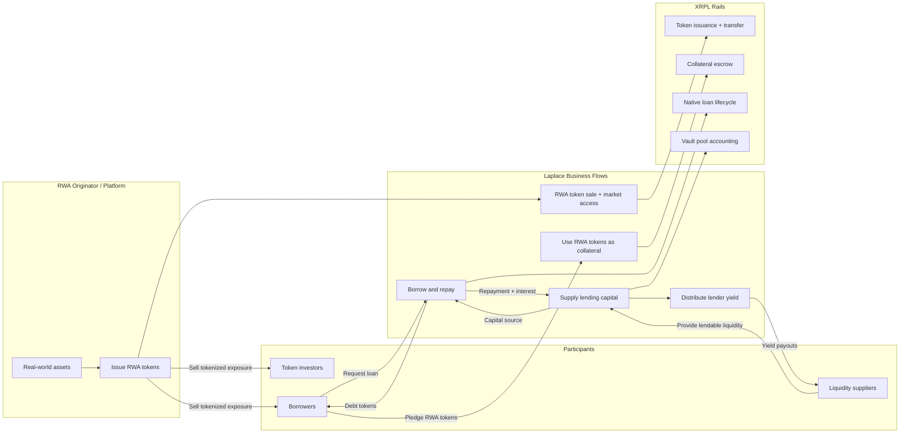
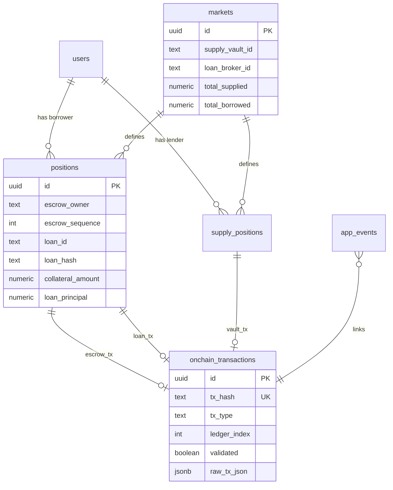
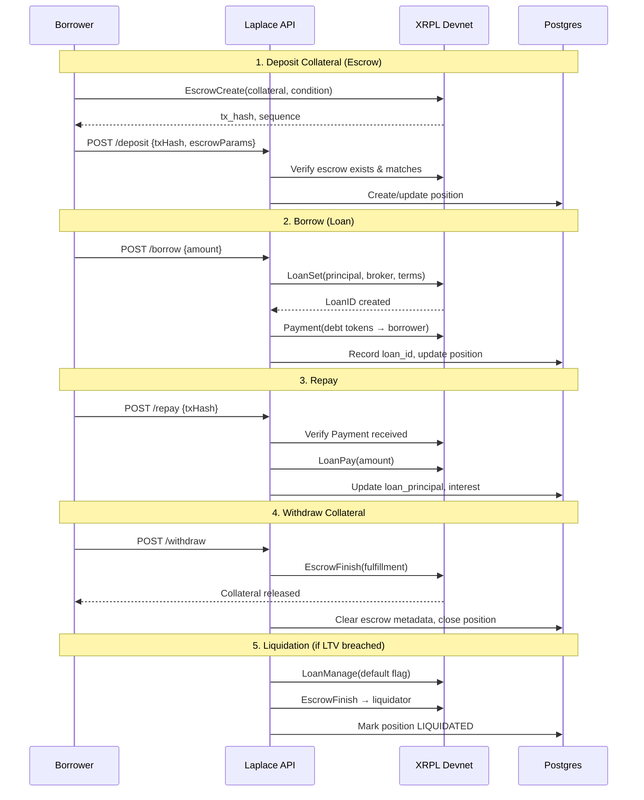

# Laplace – On-Chain Credit Infrastructure for Global Real Estate

## 1. Project Overview

Laplace builds a protocol-based credit layer for global real estate RWA by enabling tokenized property to function as reusable collateral and executing credit lines directly on the XRP Ledger.

This MVP runs entirely on XRPL Devnet and integrates XRPL-native primitives including:
- Single Asset Vault (SAV)
- Loan object
- Escrow-based collateral locking
- Multi-signature enforcement
- On-chain collateral state transitions

## 2. Problem

Real estate is the largest asset class in the world - over $350 trillion - yet once tokenized, it remains financially static. Ownership has been digitized. Collateral has not.

Tokenized real estate today cannot reliably function as reusable collateral across jurisdictions due to:
- No unified collateral registry
- Fragmented SPV governance
- Double-pledge uncertainty
- Inconsistent cross-border enforceability

As a result, liquidity requires asset sale rather than collateral reuse. The structural bottleneck in RWA markets is not token issuance - it is credit infrastructure.

## 3. Solution

Laplace builds the missing credit layer for global real estate RWA. We standardize SPV governance off-chain and anchor loan issuance and collateral state transitions directly on XRPL.

This enables:
- Deterministic on-chain collateral locking
- Verifiable loan lifecycle management
- Publicly auditable credit state transitions
- Reusable collateral instead of forced asset sales

Rather than competing with traditional mortgage markets, Laplace defines a new category: protocol-based credit infrastructure for RWA. As tokenized real estate scales globally, reusable collateral becomes the next structural on-chain layer of capital efficiency. Users can:

1. [**Supply**](https://github.com/tawago/laplace-mvp/blob/main/src/app/api/lending/markets/%5BmarketId%5D/supply/route.ts) liquidity to protocol-managed Vaults and earn yield
2. [**Deposit**](https://github.com/tawago/laplace-mvp/blob/main/src/app/api/lending/deposit/route.ts) collateral (RWA tokens) via conditional Escrow
3. [**Borrow**](https://github.com/tawago/laplace-mvp/blob/main/src/app/api/lending/borrow/route.ts) debt tokens through native Loan objects
4. [**Repay**](https://github.com/tawago/laplace-mvp/blob/main/src/app/api/lending/repay/route.ts) loans and **withdraw** collateral
5. [**Liquidate**](https://github.com/tawago/laplace-mvp/blob/main/src/app/api/lending/liquidate/route.ts) under-collateralized positions

**What is verifiabley on-chain:**
- Vault creation and deposit/withdraw operations
- Loan origination, payments, and state changes
- Escrow-based collateral locking with cryptographic conditions
- All transactions persisted

### Test Flow on Devnet
Live website: https://laplace-mvp.vercel.app/

1. Navigate to `/admin` -> Generate a local wallet, get all three faucet tokens
2. Navigate to `/lend` → Supply debt tokens (RLUSD) to the vault
3. Navigate to `/borrow` → Deposit collateral tokens(SAIL or NYRA), borrow RLUSD
4. Repay loan using regular type. To close Loan completely, Repay with "full" afterwards
5. Withdraw collateral with the exact amount you've deposited
4. Check `onchain_transactions` table for tx hashes

---

## 4. XRPL and Core Functions

| XRPL Primitive | Transaction Types Used | Purpose in Laplace |
|----------------|----------------------|-------------------|
| **Vault** (XLS-65) | [`VaultCreate`](https://github.com/tawago/laplace-mvp/blob/main/src/lib/xrpl/vault.ts#L170), [`VaultDeposit`](https://github.com/tawago/laplace-mvp/blob/main/src/lib/xrpl/vault.ts#L195), [`VaultWithdraw`](https://github.com/tawago/laplace-mvp/blob/main/src/lib/xrpl/vault.ts#L212) | Pool liquidity management; lenders deposit debt tokens, receive LP shares |
| **Loan** (XLS-66) | [`LoanBrokerSet`](https://github.com/tawago/laplace-mvp/blob/main/src/lib/xrpl/loan.ts#L275), [`LoanSet`](https://github.com/tawago/laplace-mvp/blob/main/src/lib/xrpl/loan.ts#L328), [`LoanPay`](https://github.com/tawago/laplace-mvp/blob/main/src/lib/xrpl/loan.ts#L399), [`LoanDelete`](https://github.com/tawago/laplace-mvp/blob/main/src/lib/lending/service.ts#L1749) | Native loan objects track principal, interest, maturity on-ledger |
| **Escrow** | [`EscrowCreate`](https://github.com/tawago/laplace-mvp/blob/main/src/lib/xrpl/escrow.ts#L123), [`EscrowFinish`](https://github.com/tawago/laplace-mvp/blob/main/src/lib/xrpl/escrow.ts#L262), [`EscrowCancel`](https://github.com/tawago/laplace-mvp/blob/main/src/lib/xrpl/escrow.ts#L300) | Conditional collateral locking with SHA-256 preimage conditions |
| **TrustLine** | [`TrustSet`](https://github.com/tawago/laplace-mvp/blob/main/src/lib/client/xrpl.ts#L171), [`Payment`](https://github.com/tawago/laplace-mvp/blob/main/src/lib/xrpl/tokens.ts#L88) | Token issuance and transfer for collateral/debt assets |

---

## 5. Architecture at a Glance



**Key areas:**
- **Tokenization first:** Laplace issues and distributes RWA tokens representing real-world exposure.
- **Collateralized borrowing:** borrowers lock those RWA tokens to access loan liquidity.
- **Yield model:** suppliers provide capital and earn yield from borrower repayments.
- **XRPL-backed rails:** issuance/transfers, escrow locks, loan state, and vault accounting settle on XRPL primitives.

---

## 6. Repository Structure

```
src/
├── app/
│   ├── api/
│   │   ├── lending/
│   │   │   ├── borrow/route.ts      # Loan origination
│   │   │   ├── deposit/route.ts     # Collateral escrow verification
│   │   │   ├── repay/route.ts       # Loan payment processing
│   │   │   ├── withdraw/route.ts    # Collateral release
│   │   │   ├── liquidate/route.ts   # Liquidation execution
│   │   │   └── markets/[marketId]/
│   │   │       ├── supply/route.ts  # Vault deposit
│   │   │       └── withdraw-supply/route.ts
│   │   ├── balances/route.ts
│   │   └── faucet/route.ts
│   ├── lend/page.tsx                # Lender UI
│   └── borrow/page.tsx              # Borrower UI
├── lib/
│   ├── lending/
│   │   ├── service.ts               # Core orchestration (800+ lines)
│   │   ├── positions.ts             # Position state management
│   │   ├── supply.ts                # Supply position logic
│   │   ├── pool.ts                  # Pool metrics & yield
│   │   ├── calculations.ts          # LTV, interest, liquidation math
│   │   └── events.ts                # Idempotency & event logging
│   ├── xrpl/
│   │   ├── vault.ts                 # VaultCreate/Deposit/Withdraw
│   │   ├── loan.ts                  # LoanBrokerSet/LoanSet/LoanPay
│   │   ├── escrow.ts                # EscrowCreate/Finish/Cancel
│   │   ├── tokens.ts                # TrustSet/Payment helpers
│   │   └── client.ts                # Devnet connection pooling
│   └── db/
│       ├── schema.ts                # Drizzle schema (source of truth)
│       └── seed.ts                  # Market initialization
scripts/
├── setup-devnet.ts                  # Wallet/token bootstrap
├── enable-token-escrow.ts           # Issuer flags for escrow
└── init-db.ts                       # Schema + seed data
```

---

## 7. DB ↔ Ledger Relationship



**Mapping rules:**
- `positions.loan_id` → XRPL Loan ledger entry
- `positions.escrow_owner + escrow_sequence` → XRPL Escrow ledger entry
- `markets.supply_vault_id` → XRPL Vault ledger entry
- Every state-changing operation creates an `onchain_transactions` row with the tx hash

---

## 8. Lending Lifecycle (On-Chain)



---

## 9. API Surface

### Lending Operations

| Endpoint | Method | Purpose |
|----------|--------|---------|
| `/api/lending/deposit` | POST | Verify collateral escrow, open position |
| `/api/lending/borrow` | POST | Create loan, disburse debt tokens |
| `/api/lending/repay` | POST | Process debt repayment |
| `/api/lending/withdraw` | POST | Release collateral via escrow finish |
| `/api/lending/liquidate` | POST | Execute liquidation on unhealthy position |

### Supply Operations

| Endpoint | Method | Purpose |
|----------|--------|---------|
| `/api/lending/markets/[id]/supply` | POST | Deposit to vault, receive LP shares |
| `/api/lending/markets/[id]/withdraw-supply` | POST | Withdraw from vault |
| `/api/lending/markets/[id]/collect-yield` | POST | Claim accrued interest |

### Read Operations

| Endpoint | Method | Purpose |
|----------|--------|---------|
| `/api/lending/position` | GET | Fetch borrower position metrics |
| `/api/lending/markets/[id]` | GET | Market parameters and pool state |
| `/api/lending/prices` | GET | Oracle prices for LTV calculation |
| `/api/lending/config` | GET | Protocol configuration |

---

## 10. Live Transaction Evidence

> Borrower & Lender Account: [`r3KFqgrvzkyFZ916TKSyz4N9qdmnRwhTxS`](https://devnet.xrpl.org/accounts/r3KFqgrvzkyFZ916TKSyz4N9qdmnRwhTxS)

| Operation | Tx Type | Hash | Explorer | Result |
|-----------|---------|------|----------|--------|
| Vault Creation | `VaultCreate` | `145967282D69B8F660A0F372460F0E978B57F55E47CAF3B9CFE5E39738426DB5` | [View](https://devnet.xrpl.org/transactions/145967282D69B8F660A0F372460F0E978B57F55E47CAF3B9CFE5E39738426DB5) | `tesSUCCESS` |
| Supply Deposit | `VaultDeposit` | `C6C6BA434B4E3949D0F3EE5786C1607192A8A8E3280E449591CFE856A9ADBF45` | [View](https://devnet.xrpl.org/transactions/C6C6BA434B4E3949D0F3EE5786C1607192A8A8E3280E449591CFE856A9ADBF45) | `tesSUCCESS` |
| Collateral Escrow | `EscrowCreate` | `2488F0BBBABFDB5EEC67C79EB04D15B4E7B843CD476ABB0336263B18AF13F39F` | [View](https://devnet.xrpl.org/transactions/2488F0BBBABFDB5EEC67C79EB04D15B4E7B843CD476ABB0336263B18AF13F39F) | `tesSUCCESS` |
| Loan Origination | `LoanSet` | `FE41C7FC8CC30CAD2C725BDE70C2D75D08AD0A5FB4C74DEE9E8F382ECD1E6335` | [View](https://devnet.xrpl.org/transactions/FE41C7FC8CC30CAD2C725BDE70C2D75D08AD0A5FB4C74DEE9E8F382ECD1E6335) | `tesSUCCESS` |
| Loan Payment | `LoanPay` | `5DFD04FBC22F057C1117F4A5DAD4D65931A17F58DEBBD9550561BDCCDF6EFD64` | [View](https://devnet.xrpl.org/transactions/5DFD04FBC22F057C1117F4A5DAD4D65931A17F58DEBBD9550561BDCCDF6EFD64) | `tesSUCCESS` |
| Loan Closure | `LoanDelete` | `FFB49CA90907DC2D3C27CDAFB057E5B43E2AC0A2D3A7129317E42E4C9D988EAB` | [View](https://devnet.xrpl.org/transactions/FFB49CA90907DC2D3C27CDAFB057E5B43E2AC0A2D3A7129317E42E4C9D988EAB) | `tesSUCCESS` |
| Collateral Release | `EscrowFinish` | `A11ACC77D4930ED213DE64938C3BDBE7782184D3CD738E1BC9BDECBEA50989B9` | [View](https://devnet.xrpl.org/transactions/A11ACC77D4930ED213DE64938C3BDBE7782184D3CD738E1BC9BDECBEA50989B9) | `tesSUCCESS` |
| Supply Withdraw | `VaultWithdraw` | `EC00FC1F2532FA21DBDE1424C77EE7BD289350E31A11C71D270612A2D8251EC3` | [View](https://devnet.xrpl.org/transactions/EC00FC1F2532FA21DBDE1424C77EE7BD289350E31A11C71D270612A2D8251EC3) | `tesSUCCESS` |

> `VaultCreate` was submitted by protocol account [`rs84UfRZ7CZvyNQfUN5CsYvptporja1C6H`](https://devnet.xrpl.org/accounts/rs84UfRZ7CZvyNQfUN5CsYvptporja1C6H) and creates vault `2332F4EF476D9C65EFF401FD4634B46B46ECD79027ACFC3B1F6DE628B90F2601` used by this borrower flow.

---

## 11. Quick Start

### Prerequisites

- Node.js 18+
- pnpm
- Neon Postgres database

### Setup

```bash
# Install dependencies
pnpm install

# Configure environment
cp .env.example .env.local
# Edit .env.local with:
#   DATABASE_URL=postgresql://...
#   XRPL_NETWORK=wss://s.devnet.rippletest.net:51233
#   ISSUER_SEED=...
#   BACKEND_SEED=...

# Bootstrap XRPL wallets and tokens
pnpm setup:xrpl

# Enable escrow permissions on issuer
pnpm setup:escrow

# Initialize database
pnpm setup:db
pnpm db:push

# Start development server (HTTPS on port 3001)
pnpm dev
```

### Test Flow

1. Navigate to `/lend` → Supply debt tokens to the vault
2. Navigate to `/borrow` → Connect wallet, deposit collateral, borrow
3. Repay loan and withdraw collateral
4. Check `onchain_transactions` table for tx hashes

---

## 12. Limitations

### XRPL Devnet-Only Amendments

| Amendment | Status |
|-----------|--------|
| XLS-65 (SingleAssetVault) | Devnet only |
| XLS-66 (Loan) | Devnet only |

### Known Issues

- **`tecINVARIANT_FAILED`**: Occasionally occurs on devnet under load. Retry logic mitigates most cases.
- **xrpl.js counter-party multisig gap**: The library lacks native support for broker co-signing patterns required by XLS-66. Current workaround uses the backenduses backend wallet as the sole signer.
- Price feeds are mock values in the `price_oracle` table. Production requires Chainlink/Band integration.
- **Fixed-market**: Currently supports predefined two collateral/debt pair. Multi-market expansion is architectural but not implemented.

### Security Considerations (PoC Only)

- Borrower seeds passed via API for demo convenience (production will use client-side signing)
- No rate limiting or authentication on API endpoints
- Escrow preimages stored in DB (production will use HSM/KMS)

---

## 13. Technical Roadmap

### Mainnet

1. **Wait for amendments**: XLS-65 and XLS-66 must be enabled on mainnet
2. **Client-side signing**: Remove seed transmission, use wallet adapters (Xumm, Crossmark)
3. **Oracle integration**: Connect to price feeds (Pyth, Chainlink via bridge)
4. **Audit**: Third party security review of service logic

### Feature Expansion

- Multi-market support with different collateral/debt pairs
- Variable interest rate curves based on utilization
- Governance token for protocol parameters
- Cross-chain collateral (IBC/Axelar bridge integration)

---

## 14. Tech Stack

| Layer | Technology |
|-------|------------|
| Frontend | Next.js 16, React 19, Tailwind CSS v4, shadcn/ui |
| Backend | Next.js API Routes, TypeScript |
| Database | Neon Postgres, Drizzle ORM |
| Blockchain | XRPL Devnet, xrpl.js v4.5 |
| Math | Decimal.js (arbitrary precision) |

---

## 15. Market Opportunity

Real estate is a $350+ trillion global asset class - the largest in the world.

Tokenized real-world assets are projected to reach multi-trillion-dollar scale by 2030, with real estate expected to be a dominant category as institutional adoption accelerates.

However, tokenization today enables ownership, not capital efficiency.

Most tokenized real estate remains static equity. Liquidity requires asset sale rather than collateral reuse. This creates a structural gap: RWA lacks a credit layer.

Japan represents a uniquely attractive entry market:
- Household financial assets exceed ¥2,200 trillion (~$14-15 trillion).
- Nearly 50% of these assets are held in cash and deposits, reflecting underutilized capital.
- Japanese investors actively participate in global real estate markets.
- Japan has a structured regulatory framework for security tokens and digital securities.

This combination - large capital base, high cash allocation, and regulatory clarity - creates strong conditions for reusable collateral infrastructure.

As RWA markets scale globally, the bottleneck shifts from token issuance to credit enablement.

Laplace targets this structural shift by building the on-chain credit layer for global real estate on XRPL.

## 16. Business Model

Laplace operates as protocol-based credit infrastructure rather than a balance-sheet lender. The company captures value at the infrastructure layer, scaling with the number of onboarded assets, participating lenders, and total reusable collateral volume. The model is asset-light, capital-efficient, and designed to benefit from network effects as tokenized real estate adoption expands globally.

### Revenue Model

- Credit execution fees (per loan created and collateral state transition)
- RWA onboarding & certification fees (for third-party issuers integrating into the credit framework)
- Institutional API & registry access fees (for lenders accessing verified collateral and credit state data)

This structure enables recurring, infrastructure-level revenue without deploying proprietary lending capital.

## 17. Compliance Framework

Laplace is structured to align with existing regulatory frameworks through clear role separation and jurisdictional design.

### Japan

- RWA issued by Laplace are distributed to retail investors through a licensed Type II Financial Instruments Business (FIBO) partner.
- Tokenized interests are treated as deemed securities under Japanese law.
- All regulated investor solicitation, disclosure, and distribution activities are conducted by the licensed entity.

Laplace focuses on asset structuring and protocol-level collateral state management, while regulated sales functions are handled by licensed partners.

### UAE

- Custody and liquidation are structured under a VARA-aligned framework.
- Enforcement actions follow predefined, non-discretionary contractual rules executed by licensed entities.

### Laplace's Role

Laplace:
- Issues and structures real estate RWA
- Standardizes SPV governance off-chain
- Anchors collateral and loan state on XRPL
- Does not directly conduct licensed distribution activities in regulated jurisdictions

Regulatory responsibilities are clearly allocated to appropriate licensed entities, ensuring compliance while maintaining protocol-based credit infrastructure on-chain.

## 18. Business Roadmap

### Phase 1 - Validate Model

- Issue Laplace-originated RWA
- Prove reusable collateral execution
- Onboard initial lenders

### Phase 2 - Third-Party RWA Integration

- Certify and onboard external real estate RWA
- Apply standardized collateral governance
- Expand multi-lender participation

### Phase 3 - Shared Credit Infrastructure

- Establish XRPL-based global collateral registry
- Enable cross-issuer reusable collateral
- Build network effects across issuers and lenders

### Long-Term Vision

Laplace scales by onboarding third-party RWA and institutional lenders, positioning itself as the standardized credit layer for tokenized global real estate.

## 19. Team

### Yusuke Hirota - CEO

Yusuke has over 10 years of experience leading global growth strategy, including at Amazon, where he contributed to scaling cross-border platform initiatives. He is building Laplace as the "Amazon for RWA" - a global platform that connects issuers, lenders, and investors into a unified ecosystem for real-world assets and reusable credit infrastructure.

LinkedIn: https://linkedin.com/in/yusuke-hirota-204a01150/

### Jonathan Froeming - CTO

Jonathan brings over 20 years of engineering leadership experience, including roles within Amazon's financial division and Bitbank. He leads the architecture of Laplace's XRPL-native infrastructure, designing a scalable and secure foundation for a global real-world asset platform.

LinkedIn: https://linkedin.com/in/johna1203/
