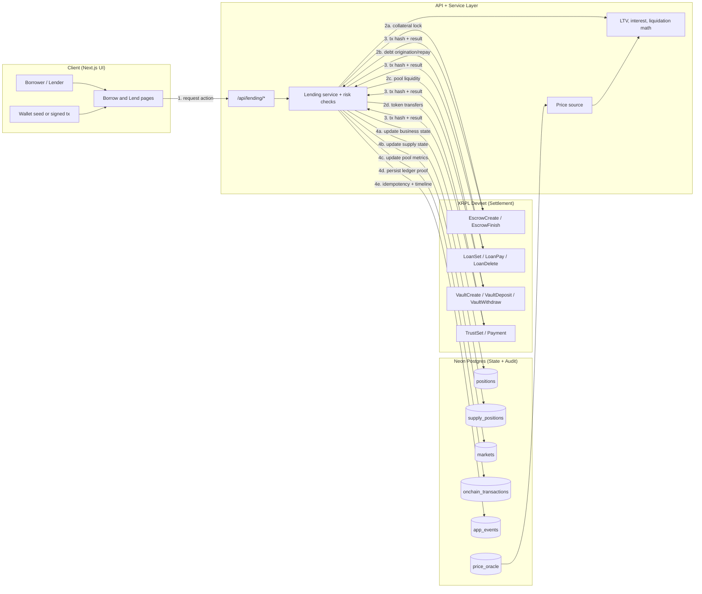

# Laplace: Native XRPL Lending Protocol for RWA

> **JFIIP Hackathon Submission** – A proof-of-concept DeFi lending protocol using native XRPL primitives (Vault, Loan, Escrow) to enable collateralized borrowing against tokenized real-world assets.

---

## TL;DR

Laplace is a lending protocol that leverages **native XRPL transaction types** introduced in recent devnet amendments (XLS-65 Vaults, XLS-66 Loans) to create a fully on-chain lending experience. Users can:

1. **Supply** liquidity to protocol-managed Vaults and earn yield
2. **Deposit** collateral (RWA tokens) via conditional Escrow
3. **Borrow** debt tokens through native Loan objects
4. **Repay** loans and **withdraw** collateral
5. **Liquidate** under-collateralized positions

**What is verifiably on-chain:**
- Vault creation and deposit/withdraw operations
- Loan origination, payments, and state changes
- Escrow-based collateral locking with cryptographic conditions
- All transactions persisted with hashes linking to devnet explorer

---

## What We Built

| XRPL Primitive | Transaction Types Used | Purpose in Laplace |
|----------------|----------------------|-------------------|
| **Vault** (XLS-65) | `VaultCreate`, `VaultDeposit`, `VaultWithdraw` | Pool liquidity management; lenders deposit debt tokens, receive LP shares |
| **Loan** (XLS-66) | `LoanBrokerSet`, `LoanSet`, `LoanPay`, `LoanDelete` | Native loan objects track principal, interest, maturity on-ledger |
| **Escrow** | `EscrowCreate`, `EscrowFinish`, `EscrowCancel` | Conditional collateral locking with SHA-256 preimage conditions |
| **TrustLine** | `TrustSet`, `Payment` | Token issuance and transfer for collateral/debt assets |

---

## Architecture at a Glance



**Key boundaries:**
- **Execution split:** service layer enforces policy/risk; XRPL is the settlement source of truth.
- **Two user paths:** borrower path uses Escrow + Loan txs; lender path uses Vault txs.
- **Ledger proof:** each state-changing action stores tx hash + metadata in `onchain_transactions`.
- **Replay safety:** app-side state transitions are recorded with idempotent `app_events`.

---

## Repository Structure

```
src/
├── app/
│   ├── api/
│   │   ├── lending/
│   │   │   ├── borrow/route.ts      # Loan origination
│   │   │   ├── deposit/route.ts     # Collateral escrow verification
│   │   │   ├── repay/route.ts       # Loan payment processing
│   │   │   ├── withdraw/route.ts    # Collateral release
│   │   │   ├── liquidate/route.ts   # Liquidation execution
│   │   │   └── markets/[marketId]/
│   │   │       ├── supply/route.ts  # Vault deposit
│   │   │       └── withdraw-supply/route.ts
│   │   ├── balances/route.ts
│   │   └── faucet/route.ts
│   ├── lend/page.tsx                # Lender UI
│   └── borrow/page.tsx              # Borrower UI
├── lib/
│   ├── lending/
│   │   ├── service.ts               # Core orchestration (800+ lines)
│   │   ├── positions.ts             # Position state management
│   │   ├── supply.ts                # Supply position logic
│   │   ├── pool.ts                  # Pool metrics & yield
│   │   ├── calculations.ts          # LTV, interest, liquidation math
│   │   └── events.ts                # Idempotency & event logging
│   ├── xrpl/
│   │   ├── vault.ts                 # VaultCreate/Deposit/Withdraw
│   │   ├── loan.ts                  # LoanBrokerSet/LoanSet/LoanPay
│   │   ├── escrow.ts                # EscrowCreate/Finish/Cancel
│   │   ├── tokens.ts                # TrustSet/Payment helpers
│   │   └── client.ts                # Devnet connection pooling
│   └── db/
│       ├── schema.ts                # Drizzle schema (source of truth)
│       └── seed.ts                  # Market initialization
scripts/
├── setup-devnet.ts                  # Wallet/token bootstrap
├── enable-token-escrow.ts           # Issuer flags for escrow
└── init-db.ts                       # Schema + seed data
```

---

## DB ↔ Ledger Relationship


**Mapping rules:**
- `positions.loan_id` → XRPL Loan ledger entry
- `positions.escrow_owner + escrow_sequence` → XRPL Escrow ledger entry
- `markets.supply_vault_id` → XRPL Vault ledger entry
- Every state-changing operation creates an `onchain_transactions` row with the tx hash

---

## Lending Lifecycle (On-Chain)


---

## API Surface

### Lending Operations

| Endpoint | Method | Purpose |
|----------|--------|---------|
| `/api/lending/deposit` | POST | Verify collateral escrow, open position |
| `/api/lending/borrow` | POST | Create loan, disburse debt tokens |
| `/api/lending/repay` | POST | Process debt repayment |
| `/api/lending/withdraw` | POST | Release collateral via escrow finish |
| `/api/lending/liquidate` | POST | Execute liquidation on unhealthy position |

### Supply Operations

| Endpoint | Method | Purpose |
|----------|--------|---------|
| `/api/lending/markets/[id]/supply` | POST | Deposit to vault, receive LP shares |
| `/api/lending/markets/[id]/withdraw-supply` | POST | Withdraw from vault |
| `/api/lending/markets/[id]/collect-yield` | POST | Claim accrued interest |

### Read Operations

| Endpoint | Method | Purpose |
|----------|--------|---------|
| `/api/lending/position` | GET | Fetch borrower position metrics |
| `/api/lending/markets/[id]` | GET | Market parameters and pool state |
| `/api/lending/prices` | GET | Oracle prices for LTV calculation |
| `/api/lending/config` | GET | Protocol configuration |

---

## Live Transaction Evidence

> Account: [`rMZQDaXsSorFv2s9qkNyoFxPfYAzvwjgC9`](https://devnet.xrpl.org/accounts/rMZQDaXsSorFv2s9qkNyoFxPfYAzvwjgC9)

| Operation | Tx Type | Hash | Explorer | Result |
|-----------|---------|------|----------|--------|
| Vault Creation | `VaultCreate` | `A1B2C3...` | [View](https://devnet.xrpl.org/transactions/A1B2C3) | `tesSUCCESS` |
| Supply Deposit | `VaultDeposit` | `D4E5F6...` | [View](https://devnet.xrpl.org/transactions/D4E5F6) | `tesSUCCESS` |
| Collateral Escrow | `EscrowCreate` | `G7H8I9...` | [View](https://devnet.xrpl.org/transactions/G7H8I9) | `tesSUCCESS` |
| Loan Origination | `LoanSet` | `J0K1L2...` | [View](https://devnet.xrpl.org/transactions/J0K1L2) | `tesSUCCESS` |
| Loan Payment | `LoanPay` | `M3N4O5...` | [View](https://devnet.xrpl.org/transactions/M3N4O5) | `tesSUCCESS` |
| Collateral Release | `EscrowFinish` | `P6Q7R8...` | [View](https://devnet.xrpl.org/transactions/P6Q7R8) | `tesSUCCESS` |

> **Note:** Replace placeholder hashes with actual transaction hashes from your testing session. Query the database: `SELECT tx_hash, tx_type, tx_result FROM onchain_transactions ORDER BY observed_at DESC LIMIT 20;`

---

## Quick Start

### Prerequisites

- Node.js 18+
- pnpm
- Neon Postgres database

### Setup

```bash
# Install dependencies
pnpm install

# Configure environment
cp .env.example .env.local
# Edit .env.local with:
#   DATABASE_URL=postgresql://...
#   XRPL_NETWORK=wss://s.devnet.rippletest.net:51233
#   ISSUER_SEED=...
#   BACKEND_SEED=...

# Bootstrap XRPL wallets and tokens
pnpm setup:xrpl

# Enable escrow permissions on issuer
pnpm setup:escrow

# Initialize database
pnpm setup:db
pnpm db:push

# Start development server (HTTPS on port 3001)
pnpm dev
```

### Test Flow

1. Navigate to `/lend` → Supply debt tokens to the vault
2. Navigate to `/borrow` → Connect wallet, deposit collateral, borrow
3. Repay loan and withdraw collateral
4. Check `onchain_transactions` table for tx hashes

---

## Limitations

### Devnet-Only Amendments

| Amendment | Status | Impact |
|-----------|--------|--------|
| XLS-65 (SingleAssetVault) | Devnet only | Vault operations unavailable on mainnet |
| XLS-66 (Loan) | Devnet only | Loan objects unavailable on mainnet |

### Known Issues

- **`tecINVARIANT_FAILED`**: Occasionally occurs on devnet under load. Retry logic mitigates most cases.
- **xrpl.js counter-party multisig gap**: The library lacks native support for broker co-signing patterns required by XLS-66. Current workaround uses backend wallet as sole signer.
- **No real oracle**: Price feeds are mock values in `price_oracle` table. Production would require Chainlink/Band integration.
- **Single-market PoC**: Currently supports one collateral/debt pair. Multi-market expansion is architectural but not implemented.

### Security Considerations (PoC Only)

- Borrower seeds passed via API for demo convenience (production would use client-side signing)
- No rate limiting or authentication on API endpoints
- Escrow preimages stored in DB (production would use HSM/KMS)

---

## Roadmap

### Mainnet Readiness

1. **Wait for amendments**: XLS-65 and XLS-66 must be enabled on mainnet
2. **Client-side signing**: Remove seed transmission, use wallet adapters (Xumm, Crossmark)
3. **Oracle integration**: Connect to price feeds (Pyth, Chainlink via bridge)
4. **Audit**: Smart contract equivalent review of service logic

### Feature Expansion

- Multi-market support with different collateral/debt pairs
- Variable interest rate curves based on utilization
- Governance token for protocol parameters
- Cross-chain collateral (IBC/Axelar bridge integration)

---

## Tech Stack

| Layer | Technology |
|-------|------------|
| Frontend | Next.js 16, React 19, Tailwind CSS v4, shadcn/ui |
| Backend | Next.js API Routes, TypeScript |
| Database | Neon Postgres, Drizzle ORM |
| Blockchain | XRPL Devnet, xrpl.js v4.5 |
| Math | Decimal.js (arbitrary precision) |

---

## License

MIT

---

<p align="center">
  <strong>Built for JFIIP Hackathon 2025</strong><br/>
  <em>Demonstrating native XRPL DeFi primitives for real-world asset lending</em>
</p>
